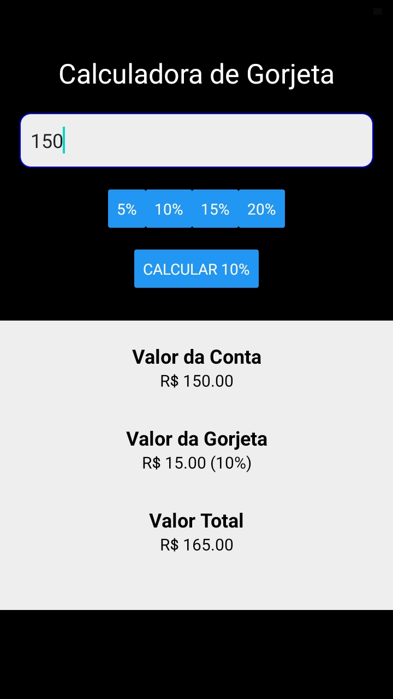

exercício concluído.

Foi criado uma calculadora de porcentagem de gorjeta, para saber quanto o funcionário vai receber.

usuário vai botar o valor recebido dentro da box.

 foi feito um código de porcentagem > setTip( (pct/100) * nBill );
e foi adicionado os valores de 5% , 10% , 15% , 20% > SetPct
então eles vão entrar constante com esse valor (5/100),(10/100),(15/100),(20/100).

          
          
          

